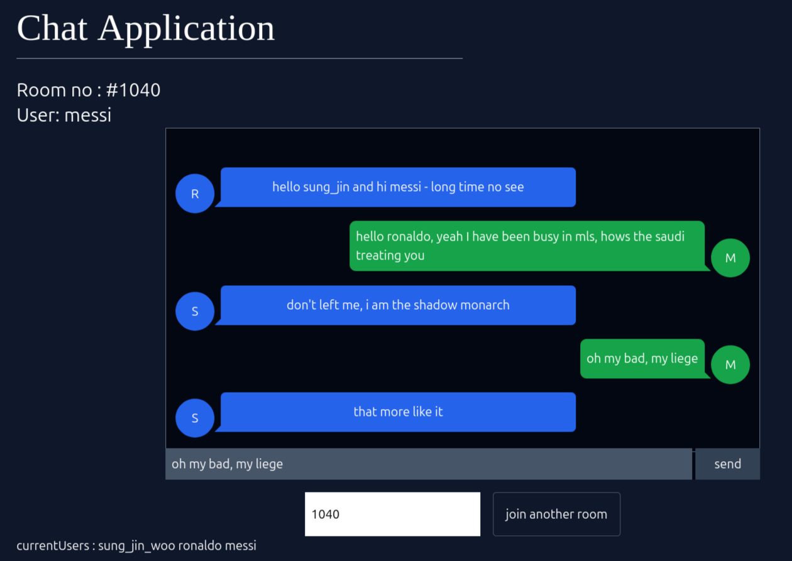

# web socket demo
- basic usage of the websocket in creation of Real time chat application

- instead checking via socket.on("close")
I have used the filter on joining instead of onclose event 
- checking the readState to WebSocket.Closed and filitering out the socket and names both.

