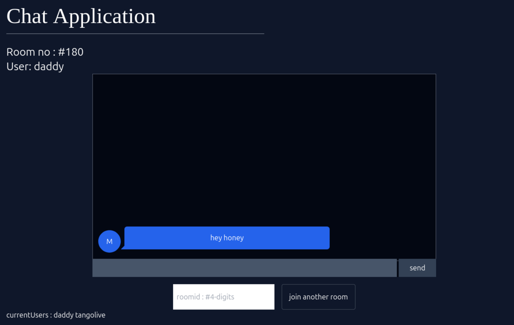

# web socket demo
- basic usage of the websocket in creation of Real time chat application

-- requires me to delete when the user is offline i.e not online -- checking via socket.on("close")
i used the filter on joining instead of onclose event -- to check for the ready state of all the clients of current room

